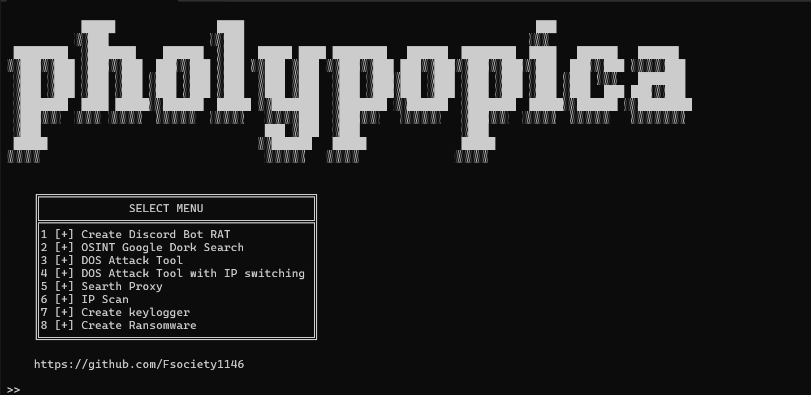
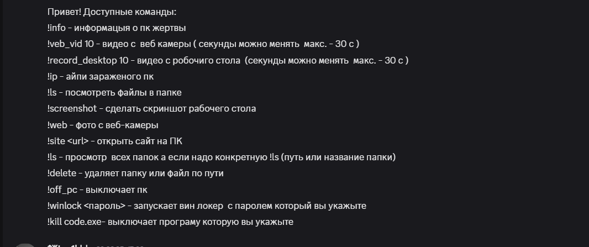
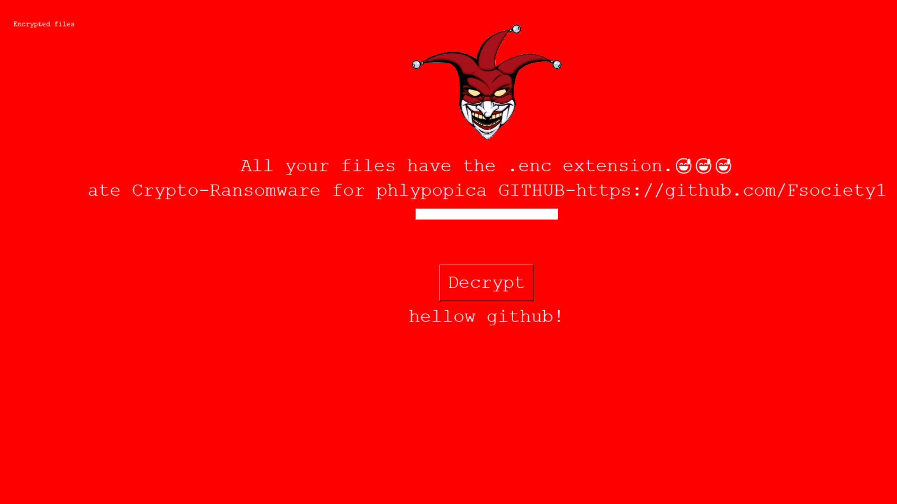
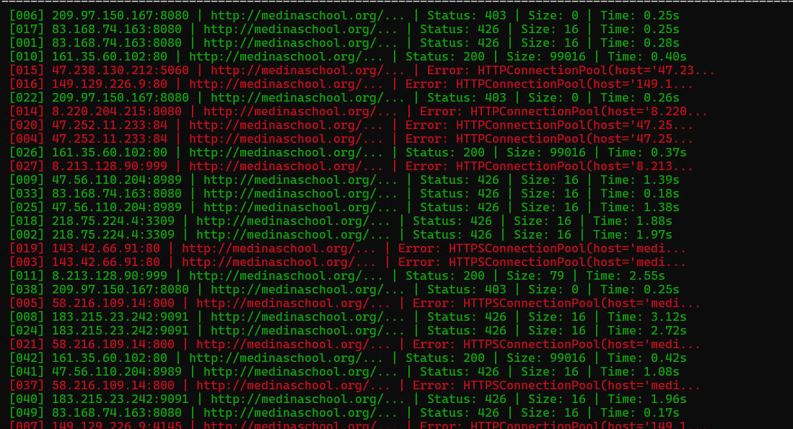
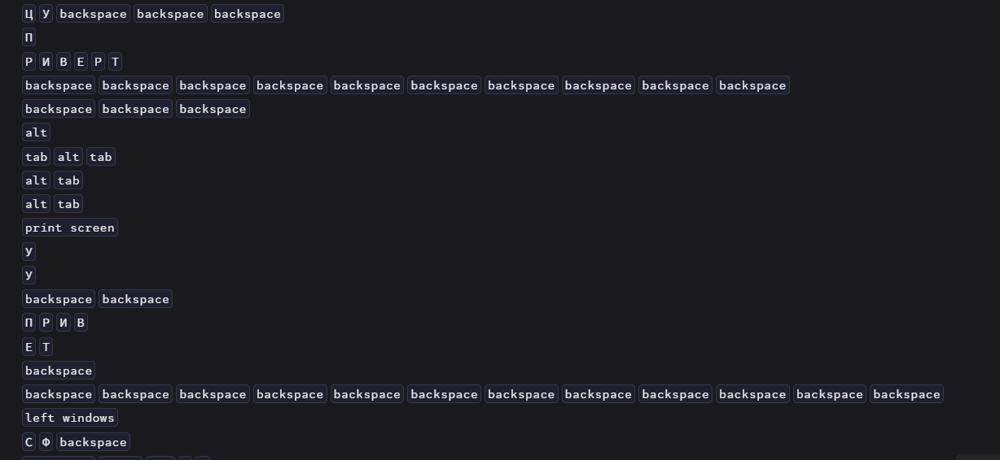
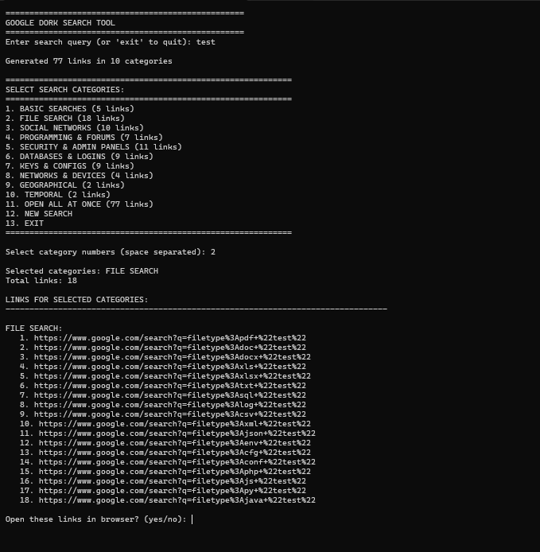

# pholypopica
the PoC 

## Overview

PholyPopica is a powerful multi-functional cybersecurity toolkit designed for security professionals, penetration testers, and researchers. This all-in-one solution combines extensive offensive security capabilities with comprehensive reconnaissance tools in a single, unified interface.

## Features

### Remote Access & Control
- **Discord RAT Bot** - Full remote administration through Discord with real-time command execution
- **System Surveillance** - Screenshot capture, webcam access, and desktop recording
- **File Management** - Remote file system exploration and manipulation
- **Process Control** - Monitor and terminate running processes

### OSINT & Reconnaissance
- **Phone Number Intelligence** - Carrier information, geographic location, and social media profiling
- **IP Analysis** - Detailed router information and network infrastructure scanning
- **Google Dork Generator** - Automated vulnerability discovery through advanced search queries
- **Network Discovery** - Active device identification and service enumeration

### Security Assessment
- **Keylogger** - Stealthy keystroke monitoring with multiple export options
- **WiFi Credential Extraction** - Recovery of stored wireless network passwords
- **Browser Data Collection** - Password, cookie, and history extraction from multiple browsers
- **Network Scanning** - Comprehensive port and service discovery

### Attack Capabilities
- **Ransomware Builder** - Customizable file encryption malware with GUI-based operation
- **DDoS Attack Suite** - Multi-threaded denial-of-service attacks with proxy support
- **ARP Spoofing** - Man-in-the-middle attacks for network interception
- **Payload Generation** - Multiple payload types for various attack scenarios

# Create Ransomware    

# DDOS Attack Tool with IP switching

# Create keylogger  

# OSINT Google Dork Search  

